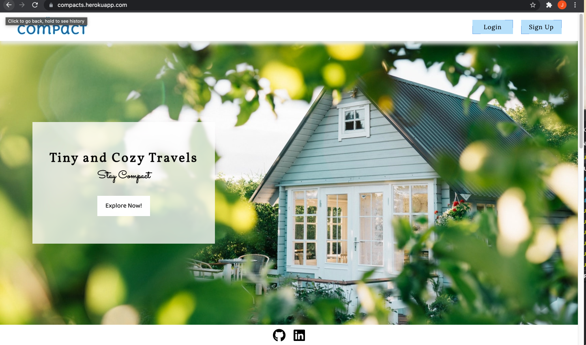
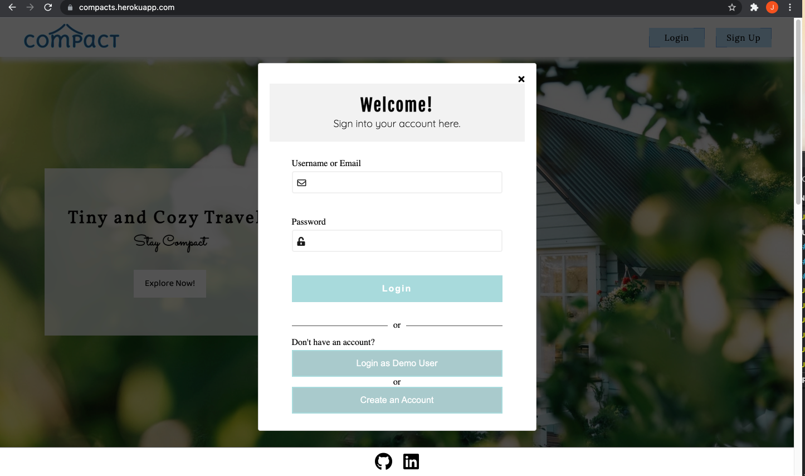
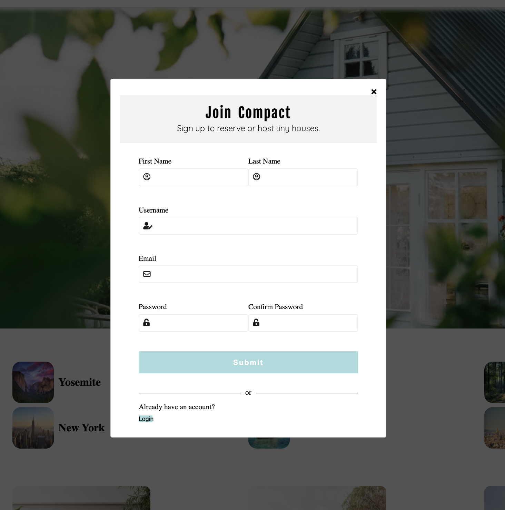
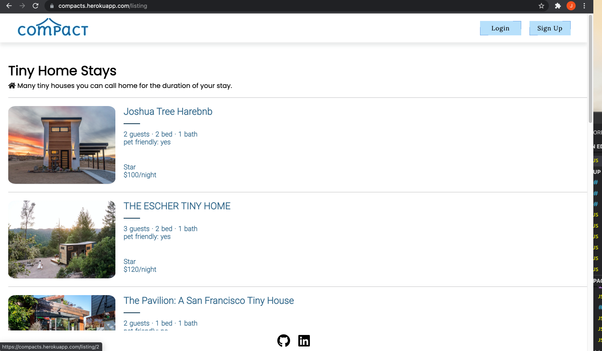
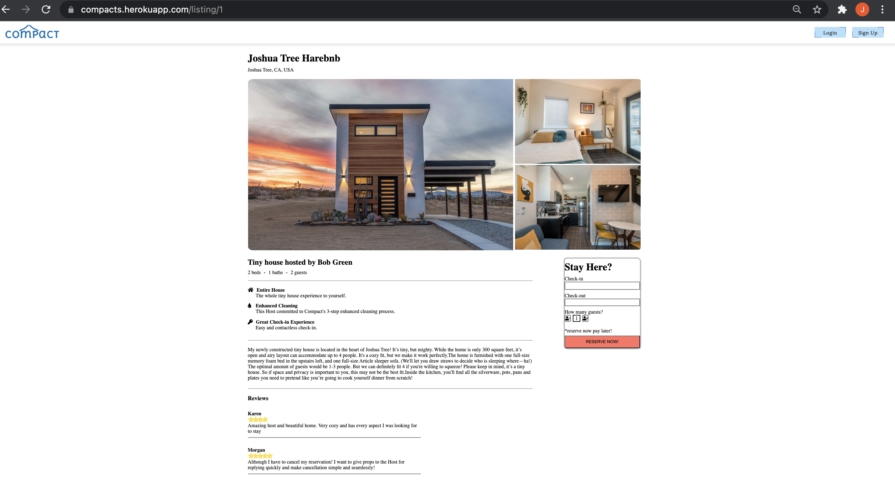
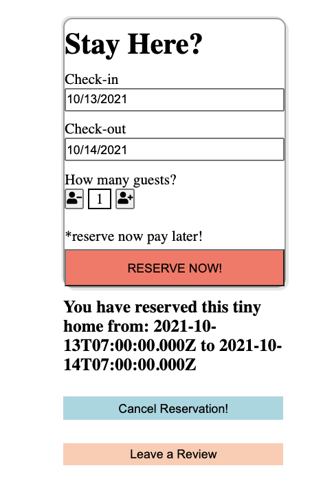
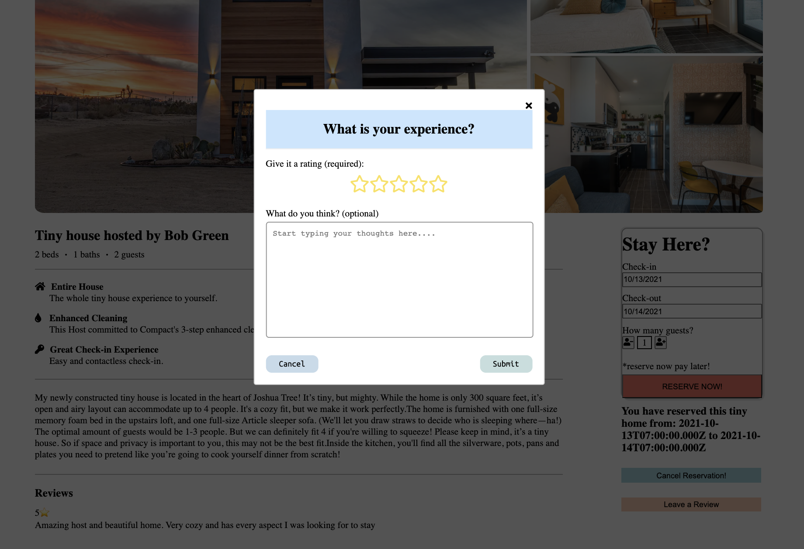
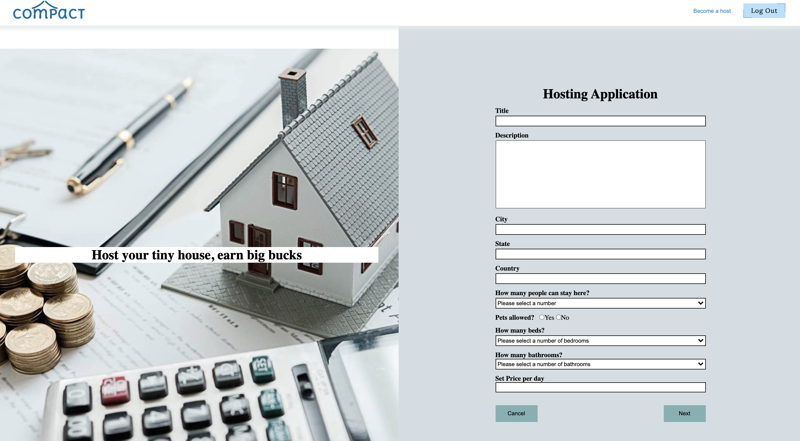

# COMPACT
live demo: https://compacts.herokuapp.com/
* Compact is a tiny home marketplace for lodging, primarily homestays for vacation rentals, and tourism activities. This fullstack application is a clone of Airbnb.  

## Technology
* Some of the technologies used to build this application: 

* Backend: Express
   * ORM: Sequelize
   * database: PostgreSQL

* Frontend: Javascript, React/Redux, CSS3
* Storage: AWS S3

### Site Walkthrough
*  This is the splash page. You can choose to sign-up for new user, login for current user.

* Login and sign up module. This is where a user can log in, log in as demo, or sign up. 

* User can see a list of tiny homes to choose from.

* In the detail page of the tiny home, you can reserve the tiny home. You can also see the other users review of the tiny home.

* Once you reserve the tiny home, you can see your reservation below.

* After you book, you can leave a review. After posting a review, user can edit or delete their own review. 

* If user want to host their tiny home, they can fill out the form.

# backend 
* npm install
* npm install -D dotenv-cli nodemon
* make .env 
    * npx dotenv sequelize db:create

# frontend
* npm install
* npm install -D redux-logger# express-react
# Compact
